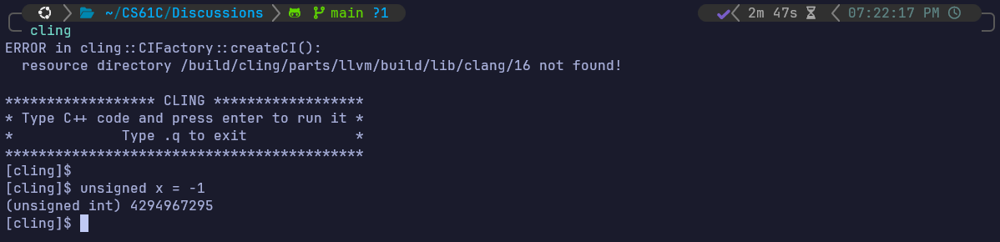

# Number Representation

## 1 Pre-Check

**1.1. Depending on the context, the same sets of bits may represent different things.**

*True*; bits can represent anything! from numbers to letters to characters and even colors.

**1.2. It is possible to get an overflow error in Two’s Complement when adding numbers of opposite signs.**

*False*; adding number of opposite signs (subtracting two numbers) can't overflow because the representable positive numbers are one-less than negative numbers.

**1.3. If you interpret a N bit Two’s complement number as an unsigned number, negative numbers would be smaller than positive numbers.**

*False*; the two's complement negative numbers representation represents the upper *unsigned* positive numbers

> (Two's Complement)-5 = (unsigned)4294967295

**1.4. If you interpret an N bit Bias notation number as an unsigned number (assume there are negative numbers for the given bias), negative numbers would be smaller than positive numbers.**

*True*; the stored biased number is already *unsigned*, so, just like real numbers, negative numbers < positive numbers

## 2 Unsigned Integers

**2.1. If we have an *n*-digit unsigned numeral**

$$
d_{n-1} d_{n-2} \dots d_{0}
$$

**in radix (or base) $r$, then the value of that numeral is**

$$
\sum_{i=0}^{n-1} r^i d_i,
$$

**which is just fancy notation to say that instead of a 10’s or 100’s place we have an $r$’s or $r^2$’s place. For the three radices—binary, decimal, and hex—we just let $r$ be 2, 10, and 16, respectively. Let’s try this by hand. Recall that our preferred tool for writing large numbers is the IEC prefixing system.**

(a) Convert the following numbers from their initial radix into the other two
common radices:

  1. 0b10010011 = 147 = 0x93
  2. 63 = 0b111111 = 0x3F
  3. 0b00100100 = 36 = 0x24
  4. 0 = 0b0 = 0x0
  5. 39 = 0b100111 = 0x27
  6. 437 = 0b110110101 = 0x1B5
  7. 0x0123 = 291 = 0b0000 0001 0010 0011

(b) Convert the following numbers from hex to binary:

  1. 0xD3AD = 0b1101 0011 1010 1101
  2. 0xB33F = 0b1011 0011 0011 1111
  3. 0x7EC4 = 0b0111 1110 1100 0100

(c) Write the following numbers using IEC prefixes:

  1. $2^{16}$ = 64 Ki
  2. $2^{27}$ = 128 Mi
  3. $2^{43}$ = 8 Ti
  4. $2^{36}$ = 64 Gi
  5. $2^{34}$ = 16 Gi
  6. $2^{61}$ = 2 Ei
  7. $2^{47}$ = 128 Ti
  8. $2^{59}$ = 512 Pi

(d) Write the following numbers as powers of 2:

  1. 2 Ki = $2^{11}$
  2. 512 Ki = $2^{19}$
  3. 16 Mi = $2^{24}$
  4. 256 Pi = $2^{58}$
  5. 64 Gi = $2^{36}$
  6. 128 Ei = $2^{67}$

## 3 Signed Integers

**3.1 Unsigned binary numbers work for natural numbers but many calculations use negative numbers as well. To deal with this, a number of different schemes have been used to represent signed numbers, but we will focus on two’s complement, as it is the standard solution for representing signed integers.**

* **Most significant bit has a negative value, all others are positive. So the value of an n-digit two’s complement number can be written as** $\sum_{i = 0}^{n-2} 2^i d_{i} - 2^{n-1} d_{n - 1}$

* **Otherwise exactly the same as unsigned integers.**

* **A neat trick for flipping the sign of a two’s complement number: flip all the bits and add 1.**

* **Addition is exactly the same as with an unsigned number.**

* **Only one 0, and it’s located at 0b0.**

**For questions (a) through (c), assume an 8-bit integer and answer each one for the case of an unsigned number, biased number with a bias of -127, and two’s complement number. Indicate if it cannot be answered with a specific representation.**

(a) What is the largest integer? What is the result of adding one to that number?
  
  1. Unsigned? 255, 0
  2. Biased? 128, -127
  3. Two’s Complement? 127, -128

(b) How would you represent the numbers 0, 1, and -1?

  1. Unsigned? 0b00000000, 0b00000001, NaN
  2. Biased? 0b011111, 0b10000000, 0b011111110
  3. Two’s Complement? 0b00000000, 0b00000001, 0b11111111

(c) How would you represent 17 and -17?

  1. Unsigned? 0b00010001, NaN
  2. Biased? 0b10010000, 0b01101110
  3. Two's Complement? 0b00010001, 0b11101111

(d) What is the largest integer that can be represented by any encoding scheme that only uses 8 bits?

No such number exists

(e) Prove that the two’s complement inversion trick is valid (i.e. that x and x + 1 sum to 0).

Note that for any x we have x + x̄ = 0b11111111. Adding 0b1 to 0b11111111 will cause the value to overflow, meaning that 0b11111111 + 0b1 = 0b0 = 0. Therefore, x̄+ x + 1 = 0̄

(f) Explain where each of the three radices shines and why it is preferred over other bases in a given context.

Decimal is the preferred radix for human hand calculations, likely related to the fact that humans have 10 fingers.

Binary numerals are particularly useful for computers. Binary signals are less likely to be garbled than higher radix signals, as there is more “distance” (voltage or current) between valid signals. Additionally, binary signals are quite convenient to design circuits, as we’ll see later in the course.

Hexadecimal numbers are a convenient shorthand for displaying binary numbers, owing to the fact that one hex digit corresponds exactly to four binary digits.

## 4 Arithmetic and Counting

**Addition and subtraction of binary/hex numbers can be done in a similar fashion as with decimal digits by working right to left and carrying over extra digits to the next place. However, sometimes this may result in an overflow if the number of bits can no longer represent the true sum. Overflow occurs if and only if two numbers with the same sign are added and the result has the opposite sign.**

(a) Compute the decimal result of the following arithmetic expressions involving 6-bit Two’s Complement numbers as they would be calculated on a computer. Do any of these result in an overflow? Are all these operations possible?

  1. 0b011001 − 0b000111 = 0b010010, no overflow
  2. 0b100011 + 0b111010 = 0b1011101 = 0b011101, added two negative numbers and got a positive one -> overflow
  3. 0x3B + 0x06 = 0b111011 + 0b000110 = 0b000001, no overflow
  4. 0xFF − 0xAA = not doable, needs 8 bits to be represented

(b) What is the least number of bits needed to represent the following ranges using any number representation scheme.

  1. 0 to 256 = 256 - 0 + 1 = 257: $2^{9}$
  2. -7 to 56 = 56 - (-7) + 1 = 64: $2^{6}$
  3. 64 to 127 and -64 to -127 = $2^{7}$
  4. Address every byte of a 12 TiB chunk of memory = $2^{44}$
