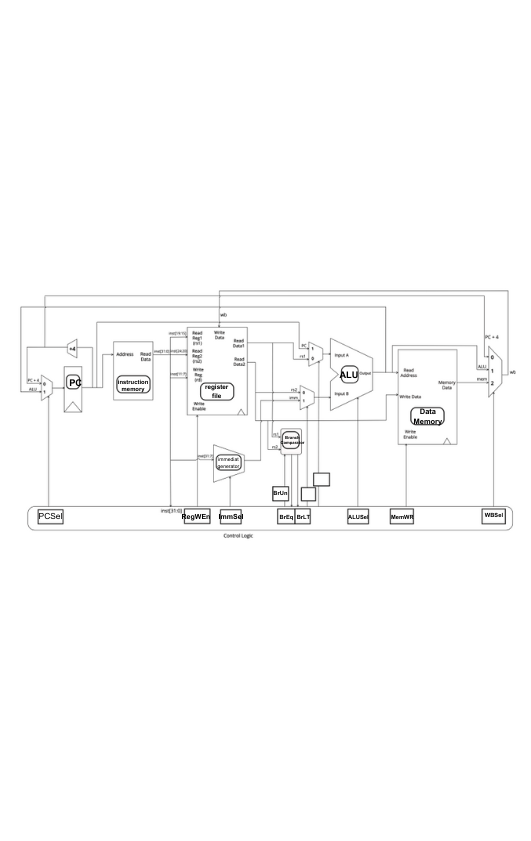

# RISC-V Single Cycle Datapath

## 1 Pre-Check

- 1.1: False, some paths are not taken in some instructions

- 1.2: False, pipelining can be used to speed up execution

- 1.3: False, it's also used in the ALU

## 2 Single-Cycle CPU

- 2.1: 

- 2.2:

| Instr | BrEq | BrLT | PCSel | ImmSel | BrUn | ASel | BSel | ALUSel | MemRW | RegWEn | WBSel |
|-------|------|------|-------|--------|------|------|------|--------|-------|--------|-------|
| add   |  *   |  *   |  0    |  *     |  *   |  0   |  0   | add    |  0    |  1     | 1(ALU)|
| ori   |      |      |       |        |      |      |      |        |       |        |       |
| lw    |      |      |       |        |      |      |      |        |       |        |       |
| sw    |      |      |       |        |      |      |      |        |       |        |       |
| beq   |      |      |       |        |      |      |      |        |       |        |       |
| jal   |      |      |       |        |      |      |      |        |       |        |       |
| bltu  |      |      |       |        |      |      |      |        |       |        |       |
