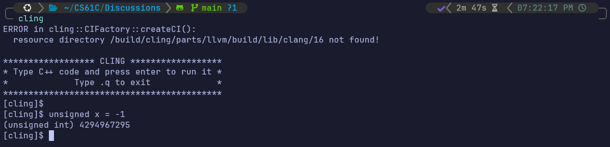

# Number Representation

## 1 Pre-Check

**1.1. Depending on the context, the same sets of bits may represent different things.**

*True*; bits can represent anything! from numbers to letters to characters and even colors.

**1.2. It is possible to get an overflow error in Two’s Complement when adding numbers of opposite signs.**

*False*; adding number of opposite signs (subtracting two numbers) can't overflow because the representable positive numbers are one-less than negative numbers.

**1.3. If you interpret a N bit Two’s complement number as an unsigned number, negative numbers would be smaller than positive numbers.**

*False*; the two's complement negative numbers representation represents the upper *unsigned* positive numbers

> (Two's Complement)-5 = (unsigned)4294967295

**1.4. If you interpret an N bit Bias notation number as an unsigned number (assume there are negative numbers for the given bias), negative numbers would be smaller than positive numbers.**

*True*; the stored biased number is already *unsigned*, so, just like real numbers, negative numbers < positive numbers

## 2 Unsigned Integers

**2.1. If we have an *n*-digit unsigned numeral**

\[
d_{n-1}d_{n-2}\dots d_{0}
\]

**in radix (or base) \(r\), then the value of that numeral is**  

\[
\sum_{i=0}^{n-1} r^i d_i,
\]

**which is just fancy notation to say that instead of a 10’s or 100’s place we have an \(r\)’s or \(r^2\)’s place. For the three radices—binary, decimal, and hex—we just let \(r\) be 2, 10, and 16, respectively. Let’s try this by hand. Recall that our preferred tool for writing large numbers is the IEC prefixing system.**

(a) Convert the following numbers from their initial radix into the other two
common radices:

  1. 0b10010011 = 147 = 0x93
  2. 63 = 0b111111 = 0x3F
  3. 0b00100100 = 36 = 0x24
  4. 0 = 0b0 = 0x0
  5. 
